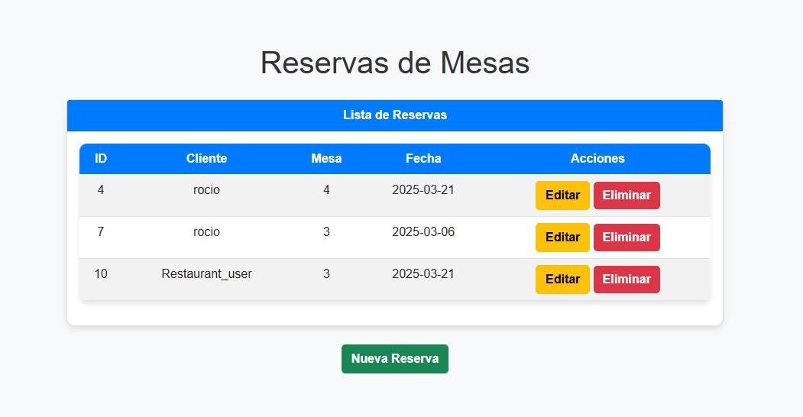
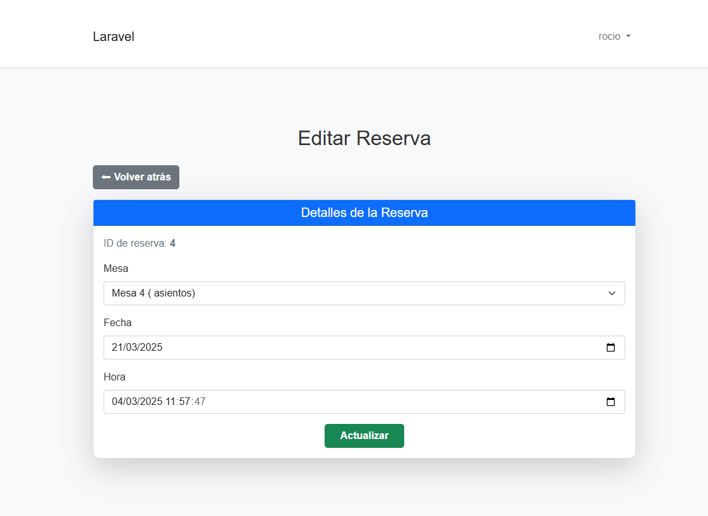
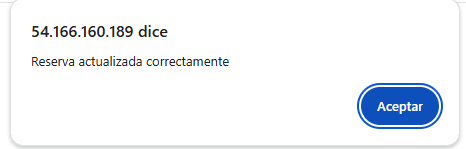
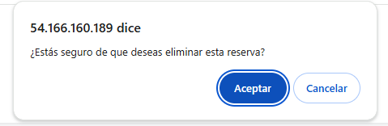

# Gestión reservas de un restaurant
Para acceder a la app puedes o iniciar sesión, si ya tienes una cuenta registrada, o registrarte.

Luego de la verificación podrás acceder a la tabla con la lista de reservas activas.

Estas reservas se pueden editar

Cada acción cuenta con su mensaje de confirmación

También se pueden eliminar las reservas 
